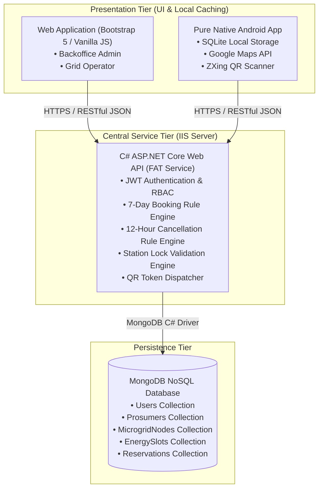
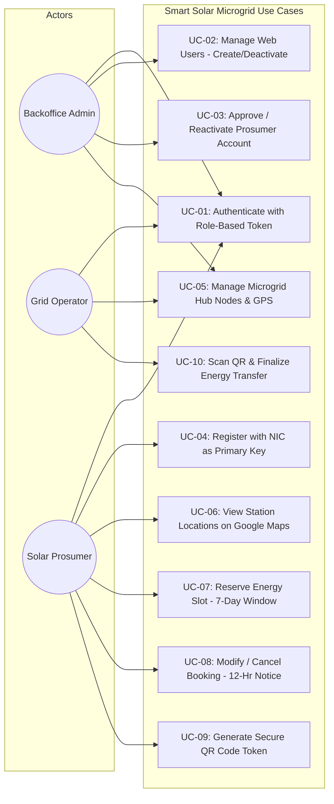
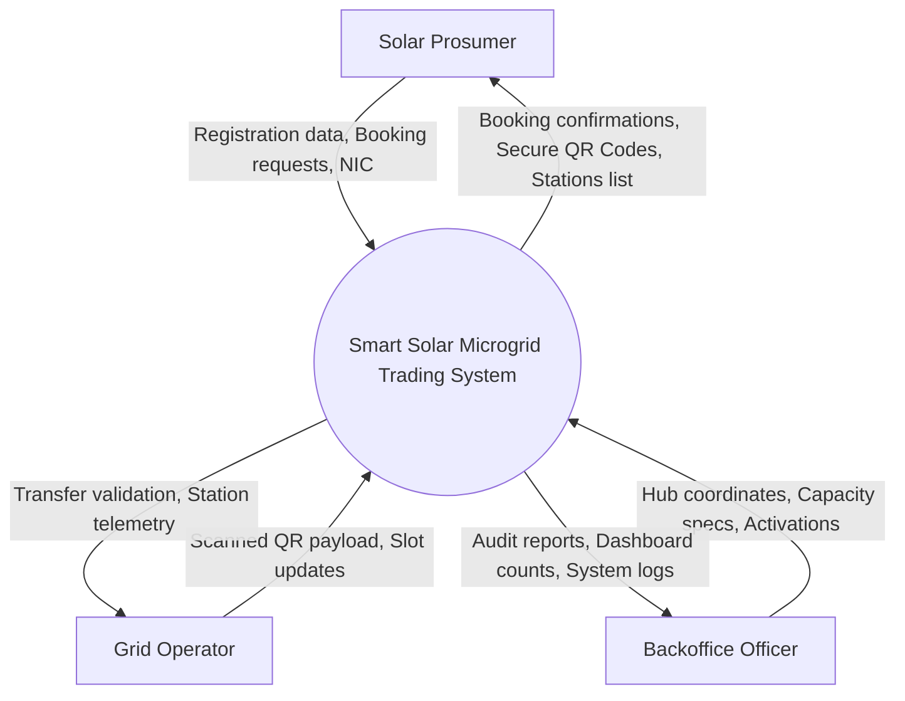

# Smart Solar Microgrid Trading System – Detailed Project Report
**Module:** SE4040 Enterprise Application Development  
**Academic Year:** Year 4 Semester 2 (2026)  
**Specialization:** BSc (Hons) in Information Technology Specialized in Software Engineering  
**Assignment:** Assignment 1 – Client-Server Application (Web, Mobile and Web Service)  

---

## Table of Contents
1. [Executive Summary](#1-executive-summary)
2. [System Architecture and High-Level Diagram](#2-system-architecture-and-high-level-diagram)
3. [Use Case Analysis & Diagram](#3-use-case-analysis--diagram)
4. [Data Flow Diagrams (DFD Level 0 & Level 1)](#4-data-flow-diagrams-dfd-level-0--level-1)
5. [Database Design & Data Modeling](#5-database-design--data-modeling)
6. [FAT Service Pattern & Business Logic Enforcement](#6-fat-service-pattern--business-logic-enforcement)
7. [Client Application Implementations](#7-client-application-implementations)
   - [7.1 Web Application (Backoffice & Grid Operator)](#71-web-application-backoffice--grid-operator)
   - [7.2 Pure Native Android Application (Prosumer & Operator)](#72-pure-native-android-application-prosumer--operator)
8. [IIS Hosting and Deployment Guide](#8-iis-hosting-and-deployment-guide)
9. [Individual Contributions Breakdown](#9-individual-contributions-breakdown)
10. [AI Disclosure and Reflection (CLEAR Framework Level 2)](#10-ai-disclosure-and-reflection-clear-framework-level-2)
11. [Challenges Encountered & Solutions](#11-challenges-encountered--solutions)
12. [References](#12-references)

---

## 1. Executive Summary
The transition towards decentralized renewable energy demands intelligent software infrastructure capable of orchestrating peer-to-grid power trading. The **Smart Solar Microgrid Trading System** delivers an end-to-end distributed client-server ecosystem designed to manage solar energy trading hubs, battery slot allocations, and trading reservations between prosumers and microgrid stations. 

The system strictly adheres to the **FAT Service architectural pattern**, utilizing a centralized C# .NET 8 Web API deployed to Windows IIS with MongoDB NoSQL persistence. Client interfaces include a Bootstrap 5 web portal for administrative operations and a pure native Android application featuring SQLite local persistence, Google Maps API station tracking, and camera-based QR code verification for final energy transfer authorization.

---

## 2. System Architecture and High-Level Diagram

The system employs a 3-tier distributed client-server architecture. All business rules, time-window validations, cryptographic operations, and database access are concentrated in the central service. Neither client interacts directly with MongoDB.



---

## 3. Use Case Analysis & Diagram

The system accommodates three key user roles:
1. **Backoffice Administrator:** Full administrative rights, user provisioning, prosumer account activation/reactivation, node lifecycle management.
2. **Grid Operator:** Operational tasks, node battery slot monitoring, on-site QR scanning and energy transfer completion.
3. **Solar Prosumer:** Self-registration via NIC, profile maintenance, slot reservation creation, schedule cancellation, QR display.



---

## 4. Data Flow Diagrams (DFD Level 0 & Level 1)

### 4.1 Level 0: Context Diagram


### 4.2 Level 1: System Function Decomposition
```mermaid
flowchart TD
    P[Solar Prosumer] -->|Credentials| P1[1.0 Authentication & Identity Service]
    P1 -->|JWT Token| P
    P -->|NIC, Personal details| P2[2.0 Prosumer Lifecycle Service]
    P2 -->|Pending profile| D1[(Prosumers Collection)]
    
    A[Backoffice Admin] -->|Approval action| P2
    P2 -->|Active status| D1

    A -->|GPS, Capacity, Slots| P3[3.0 Microgrid Hub Management]
    P3 -->|Node specs| D2[(MicrogridNodes Collection)]

    P -->|Reservation request (<= 7 days)| P4[4.0 Energy Reservation Engine]
    D2 -.->|Validate active node status| P4
    P4 -->|Pending reservation| D3[(Reservations Collection)]
    
    A & O[Grid Operator] -->|Approve booking| P4
    P4 -->|Approved + QR Data| D3
    D3 -->|Render QR Code| P

    O -->|Scan QR string| P5[5.0 Operator Verification & Transfer Engine]
    P5 -->|Query & match QR| D3
    P5 -->|Update status to Completed| D3
```

---

## 5. Database Design & Data Modeling

The server persistence layer uses MongoDB (NoSQL). The database design consists of four primary collections and one sub-collection structured to support rapid lookups and atomic state transitions.

### 5.1 Collections Schema & Data Dictionary

#### 1. `Users` Collection (Web Admin & Operators)
| Field Name | BSON Type | Constraints / Indexes | Description |
|---|---|---|---|
| `_id` | ObjectId | Primary Key | Unique document identifier |
| `username` | String | Unique Index, Required | User login handle |
| `email` | String | Unique Index, Required | Official contact email |
| `passwordHash` | String | Required | BCrypt-hashed password |
| `role` | String | Required | `"Backoffice"` or `"GridOperator"` |
| `isActive` | Boolean | Default: `true` | Account active flag |
| `createdAt` | DateTime | Default: `UtcNow` | Record creation timestamp |
| `updatedAt` | DateTime | Default: `UtcNow` | Record modification timestamp |

#### 2. `Prosumers` Collection (Solar Property Owners)
| Field Name | BSON Type | Constraints / Indexes | Description |
|---|---|---|---|
| `_id` | ObjectId | Internal Key | Internal document ID |
| `nic` | String | Unique Index, **Primary Key** | Sri Lankan National Identity Card Number |
| `firstName` | String | Required | Prosumer legal first name |
| `lastName` | String | Required | Prosumer legal surname |
| `email` | String | Unique Index, Required | Personal email address |
| `phone` | String | Required | Mobile contact number |
| `address` | String | Required | Solar installation physical address |
| `passwordHash` | String | Required | BCrypt-hashed password |
| `status` | String | Index, Default: `"Pending"` | `"Pending"`, `"Active"`, `"Deactivated"` |
| `createdAt` | DateTime | Default: `UtcNow` | Timestamp of self-registration |
| `updatedAt` | DateTime | Default: `UtcNow` | Timestamp of latest state change |

#### 3. `MicrogridNodes` Collection (Solar Station Hubs)
| Field Name | BSON Type | Constraints / Indexes | Description |
|---|---|---|---|
| `_id` | ObjectId | Primary Key | Unique station ID |
| `nodeName` | String | Required | Station hub identifier |
| `location` | String | Required | Geographical address/city |
| `latitude` | Double | Required, 2dsphere | GPS Latitude coordinate |
| `longitude` | Double | Required, 2dsphere | GPS Longitude coordinate |
| `capacityKWh` | Double | Required, Positive | Total power transfer capacity |
| `batterySlots`| Integer | Required | Total physical battery slots |
| `availableBatterySlots` | Integer | Required | Currently unassigned slots |
| `schedule` | String | Required | Operational hours (e.g. `"06:00-18:00"`) |
| `isActive` | Boolean | Default: `true` | Operational status of hub |

#### 4. `Reservations` Collection (Trading Bookings)
| Field Name | BSON Type | Constraints / Indexes | Description |
|---|---|---|---|
| `_id` | ObjectId | Primary Key | Unique reservation identifier |
| `prosumerNic`| String | Foreign Ref -> `Prosumers.nic` | NIC of trading prosumer |
| `nodeId` | String | Foreign Ref -> `MicrogridNodes._id` | Associated microgrid node |
| `slotId` | String | Foreign Ref -> `EnergySlots._id` | Allocated time slot |
| `reservationDate` | DateTime | Index | Scheduled trade timestamp |
| `energyKWh` | Double | Positive | Amount of energy booked (kWh) |
| `status` | String | Index | `"Pending"`, `"Approved"`, `"Cancelled"`, `"Completed"` |
| `qrCodeData` | String | Optional, Unique when approved | Cryptographic verification string |
| `createdAt` | DateTime | Default: `UtcNow` | Booking submission timestamp |
| `updatedAt` | DateTime | Default: `UtcNow` | Status change timestamp |

---

## 6. FAT Service Pattern & Business Logic Enforcement

The core requirement of this architecture is the strict **FAT Service pattern**. Client applications (Android and Web) are restricted to UI presentation and data entry. The central API enforces the following enterprise rules:

1. **7-Day Reservation Scheduling Rule:**
   - Any booking submitted with a `reservationDate` beyond 7 days (`DateTime.UtcNow.AddDays(7)`) or in the past is rejected with an HTTP 400 Bad Request.
2. **12-Hour Cancellation & Update Rule:**
   - Updates and cancellations require at least 12 hours' notice (`reservationDate > DateTime.UtcNow.AddHours(12)`). Attempted cancellations within 12 hours of the slot are denied.
3. **Active Reservation Node Lockout Rule:**
   - A microgrid node cannot be deactivated if any reservation associated with it is currently `"Pending"` or `"Approved"`. The API executes a count query on `Reservations` and blocks deletion if active bookings exist.
4. **NIC Primary Key Integrity:**
   - Prosumers can only be registered if their NIC is globally unique. Deactivated accounts can only transition back to `"Active"` via an authorized Backoffice administrator.
5. **Secure QR Code Dispatch & Verification:**
   - Upon reservation approval by an operator or backoffice, a unique cryptographic token `SMTS-{ReservationId}-{NIC}-{GUID}` is generated. When scanned by the operator's mobile camera, the API matches this string before committing the `"Completed"` status.

---

## 7. Client Application Implementations

### 7.1 Web Application (Bootstrap 5)
- **Framework:** HTML5, Bootstrap 5.3, Bootstrap Icons, Vanilla JavaScript (ES6 Modules).
- **Security:** Bearer token injection via `getAuthHeaders()` on every fetch call; automatic session termination on HTTP 401.
- **Pages Implemented:**
  - `index.html`: Landing page with responsive feature highlights.
  - `pages/login.html`: Unified role-based authentication portal.
  - `pages/dashboard.html`: Live metrics, pending counts, and prosumer activation workbench.
  - `pages/users.html`: Backoffice user administration modal CRUD.
  - `pages/prosumers.html`: Filterable prosumer status directory with activation/reactivation controls.
  - `pages/nodes.html`: Grid hub specifications, GPS coordinates, and deactivation safeguards.
  - `pages/reservations.html`: Comprehensive booking inspection and approval interface.

### 7.2 Pure Native Android Application (No Cross-Platform Frameworks)
- **Environment:** Android SDK (minSdk 24, targetSdk 34), Java 8, Gradle.
- **Local Persistence:** Android `SQLiteOpenHelper` (`DatabaseHelper.java`) caching user credentials, offline session tokens, and local reservation records.
- **Networking:** Multi-threaded asynchronous HTTP client (`ApiClient.java`) utilizing standard Java `HttpURLConnection` and `ExecutorService`.
- **Hardware Integration:**
  - Camera & QR Scanning: ZXing Android Embedded library (`QrScannerActivity.java`) decoding prosumer tokens in real time.
  - Google Maps API: `SupportMapFragment` (`NearbyNodesActivity.java`) plotting station markers from GPS coordinates stored on the server.
- **Summary UI Feedback:** Confirmation dialogs with itemized booking details shown immediately after booking creation, update, and cancellation.

---

## 8. IIS Hosting and Deployment Guide

To deploy the C# Web API on Windows IIS:

1. **Enable IIS and ASP.NET Core Hosting Bundle:**
   - Ensure the .NET 8 Hosting Bundle is installed on the Windows host.
2. **Publish the Project:**
   ```powershell
   cd Server\SmartSolarMicrogridAPI
   dotnet publish -c Release -o C:\inetpub\wwwroot\SmartSolarAPI
   ```
3. **Configure IIS Application Pool:**
   - Open IIS Manager -> Application Pools -> Add Application Pool.
   - Set .NET CLR Version to **"No Managed Code"** and Identity to `ApplicationPoolIdentity`.
4. **Add IIS Website / Application:**
   - Point the physical path to `C:\inetpub\wwwroot\SmartSolarAPI`.
   - Set binding to Port `5000` or `443` (with SSL Certificate).
5. **Verify Hosting:**
   - Navigate to `http://localhost:5000/swagger` to confirm the API is reachable.

---

## 9. Individual Contributions Breakdown

| Member Name & IT Number | Git Feature Branch | Detailed Tasks & Deliverables | SE4040 Mark Mapping |
|---|---|---|---|
| **Member 1** (ITXXXXXXX) | `member1-web-backoffice` | Designed the C# Web API solution, MongoDB context, and JWT authentication middleware. Developed Web Application User Management and Microgrid Node Hub CRUD with deactivation safeguards. | **18 Marks** (Web Features & Rules) |
| **Member 2** (ITXXXXXXX) | `member2-mobile-prosumer-accounts` | Built Android Prosumer Registration with NIC primary key validation, login routing, profile editing, and account deactivation requests. Developed Web App Pending Activations table. | **9 Marks** (Mobile Auth & Account) |
| **Member 3** (ITXXXXXXX) | `member3-mobile-reservation-workflow` | Developed Android Energy Slot Booking workflow. Implemented the 7-day future booking rule, 12-hour cancellation notice validation, and post-action summary confirmation pages. | **9 Marks** (Reservation Workflow) |
| **Member 4** (ITXXXXXXX) | `member4-mobile-operator-maps` | Developed Android Prosumer Dashboard (pending & future approved counts), Google Maps station locator, Grid Operator QR Scanner verification, and SQLite local persistence layer. | **29 Marks** (Dashboards, Maps, QR, Persistence) |

---

## 10. AI Disclosure and Reflection (CLEAR Framework Level 2)

### 10.1 AI Planning Disclosure
In compliance with the **CLEAR Framework (Level 2: AI Planning)**, generative AI tools were utilized exclusively during the initial planning, domain modeling, and schema drafting phase. 

### 10.2 Student Reflection
- **What was planned using AI:** Initial brainstorming of microgrid energy trading entities, schema structuring for MongoDB collections, and outlining RESTful route conventions.
- **Critical Evaluation & Refinement:** The AI-suggested generic relational models were refactored into a document-oriented structure appropriate for MongoDB. The strict enterprise constraints—such as preventing node deletion during active bookings and enforcing the 12-hour cancellation limit—were designed and implemented directly by team members in the C# service layer.
- **Viva Readiness:** Every team member understands the complete codebase, data flow, and underlying framework APIs, and is prepared to explain and modify any section of the source code during the supervised viva examination.

---

## 11. Challenges Encountered & Solutions

1. **Enforcing Pure Native Android without Third-Party Architecture Frameworks:**
   - *Challenge:* Ensuring seamless REST integration without external heavy frameworks (like Flutter or React Native).
   - *Solution:* Implemented a native `HttpURLConnection` wrapper using Java thread pools (`ExecutorService`) and `Handler(Looper.getMainLooper())` for thread-safe UI updates.
2. **Concurrently Enforcing the 12-Hour Cancellation Rule across Timezones:**
   - *Challenge:* Server and mobile client time disparities could cause false rejection of valid cancellations.
   - *Solution:* Standardized all timestamps across MongoDB, ASP.NET Core, and Android to ISO 8601 UTC (`DateTime.UtcNow`).
3. **Blocking Microgrid Node Deactivation during Active Bookings:**
   - *Challenge:* Maintaining referential integrity in a NoSQL database without foreign key constraints.
   - *Solution:* Implemented service-level transaction verification in `MicrogridNodeService.DeactivateAsync()` that queries the `Reservations` collection for active dependencies before updating node status.

---

## 12. References
1. Microsoft Corporation, "ASP.NET Core Web API Documentation," *Microsoft Learn*, 2024. [Online]. Available: https://learn.microsoft.com/en-us/aspnet/core/web-api/
2. MongoDB Inc., "MongoDB C# Driver Reference Documentation (v2.28)," 2024. [Online]. Available: https://www.mongodb.com/docs/drivers/csharp/
3. Google Developers, "Google Maps Android API Guides," 2024. [Online]. Available: https://developers.google.com/maps/documentation/android-sdk
4. Android Open Source Project, "Save data using SQLite," *Android Developers*, 2024. [Online]. Available: https://developer.android.com/training/data-storage/sqlite
5. JourneyApps, "ZXing Android Embedded Barcode Scanner," 2024. [Online]. Available: https://github.com/journeyapps/zxing-android-embedded

