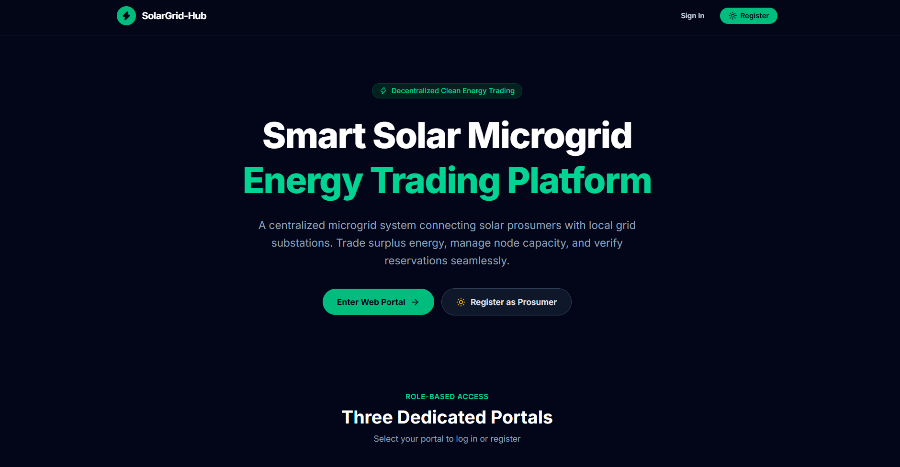
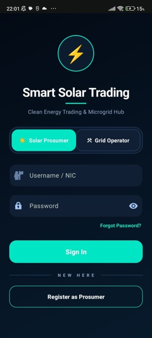

# Smart Solar Microgrid Trading System – Client-Server Application (Web, Mobile & Web Service)

[]()
[]()
[]()
[]()
[]()
[]()

---

## 🔗 Repository and Demonstration Video

- **Git repository:** [SahanMedhawa/SolarGrid-Hub](https://github.com/SahanMedhawa/SolarGrid-Hub.git)
- **Demonstration video:** [Watch the application demonstration](https://mysliit-my.sharepoint.com/:f:/g/personal/it23212404_my_sliit_lk/IgDAtYG_LuhWT6KLq4CoQV0JAagsa7jc00QOSuqkXJR2gHc?e=xsegQI)

The demonstration video is limited to five minutes and explains the main application workflow across the web application, mobile application, and backend web service.

---

## 📌 1. Project Overview & Architecture
The **Smart Solar Microgrid Trading System** is an enterprise-scale, client-server distributed system designed for decentralized solar energy trading. The system follows the strict **FAT Service Architecture Pattern**, where all business rules, data validation, and scheduling logic reside exclusively within the central C# Web API hosted on Windows IIS Server.

- **Web Application:** Dedicated UI for **Backoffice Administrators** and **Grid Operators** built using Bootstrap 5.
- **Mobile Application:** Pure Native Android application with local **SQLite database** persistence (no third-party cross-platform frameworks) serving both **Solar Prosumers** and **Grid Operators**.
- **Web Service:** C# .NET 8 RESTful Web API with MongoDB persistence, JWT authentication, and IIS hosting compatibility.

---

## 🖼️ Application Screenshots

### Web Application Landing Page



### Mobile Application Login




## 📂 2. Repository Directory Structure

```text
EAD/
├── .gitignore                            # Comprehensive .NET, Android, & IDE ignore rules
├── README.md                             # Project documentation, setup guide, & team allocation
├── SmartSolarMicrogrid.sln               # Visual Studio Solution file
├── Docs/                                 # Complete documentation & diagrams for the report
│   ├── PROJECT_REPORT.md                 # Full detailed report (Architecture, Use Case, DFD, DB, AI reflection)
│   └── TESTING_AND_API_SPEC.md           # API endpoints, test scenarios, & payload documentation
├── Server/
│   └── SmartSolarMicrogridAPI/           # C# .NET 8 Web API Project
│       ├── Controllers/                  # REST Controllers (Auth, User, Prosumer, Node, Reservation, Slot)
│       ├── Data/                         # MongoDbContext, MongoDbSettings, and DbSeeder
│       ├── Models/                       # Domain entities & DTOs
│       ├── Services/                     # Business logic services (FAT service enforcement)
│       ├── Program.cs                    # Application startup, JWT config, CORS, DI
│       └── appsettings.json              # Connection strings and JWT keys
├── WebApp/                               # Responsive Bootstrap 5 Web Client
│   ├── index.html                        # Landing page
│   ├── css/style.css                     # Custom styles and status badge styles
│   ├── js/                               # Modular scripts (api.js, auth.js, config.js)
│   └── pages/                            # Web pages
│       ├── login.html                    # Unified login portal
│       ├── dashboard.html                # Backoffice & Operator metric dashboard & pending activations
│       ├── users.html                    # Backoffice user management CRUD
│       ├── prosumers.html                # Prosumer approval, deactivation & reactivation
│       ├── nodes.html                    # Solar grid hub management (lat/long, capacity, schedule)
│       └── reservations.html             # Slot reservations management & approvals
└── MobileApp/
    └── SmartSolarMicrogrid/              # Pure Native Android Project (Java, SQLite)
        ├── build.gradle                  # Top-level Gradle script
        ├── settings.gradle               # Gradle settings
        └── app/
            ├── build.gradle              # App dependencies (ZXing QR, Maps, SQLite)
            └── src/main/
                ├── AndroidManifest.xml   # Permissions (Internet, Camera, Location, Maps)
                ├── java/com/smartsolar/microgrid/
                │   ├── api/ApiClient.java              # Pure HTTP client for FAT API calls
                │   ├── data/DatabaseHelper.java       # Pure native SQLite OpenHelper
                │   ├── data/SessionManager.java        # JWT session & SQLite sync
                │   ├── models/                         # POJO models (Prosumer, Node, Reservation)
                │   ├── ui/auth/                        # LoginActivity, RegisterActivity
                │   ├── ui/prosumer/                    # ProsumerMainActivity, ProfileActivity,
                │   │                                   # CreateReservationActivity, ReservationListActivity,
                │   │                                   # ReservationDetailActivity, NearbyNodesActivity
                │   ├── ui/operator/                    # OperatorMainActivity, QrScannerActivity
                │   └── utils/Constants.java            # API Base URL & shared keys
                └── res/                                # XML Layouts, drawables, colors, strings
```

---

## ⚡ 3. Quick Start & Setup Instructions

### Prerequisites
- [.NET 8 SDK](https://dotnet.microsoft.com/download/dotnet/8.0)
- [MongoDB Community Server](https://www.mongodb.com/try/download/community) (running on `mongodb://localhost:27017`)
- [Android Studio Iguana / Jellyfish or newer](https://developer.android.com/studio)
- [Internet Information Services (IIS)](https://learn.microsoft.com/en-us/aspnet/core/host-and-store/iis/) or Kestrel for local testing

### A. Run C# Web API Backend
1. Open PowerShell and navigate to the API directory:
   ```powershell
   cd Server\SmartSolarMicrogridAPI
   ```
2. Restore dependencies and start the API:
   ```powershell
   dotnet restore
   dotnet run
   ```
3. The API will start at `https://localhost:5001` or `http://localhost:5000`.
4. Open Swagger UI in your browser: `http://localhost:5000/swagger`
5. *Note:* On first startup, `DbSeeder.cs` will automatically populate initial users, prosumers, grid nodes, slots, and sample reservations into MongoDB.

### B. Run Web Application Frontend
1. Open `WebApp/js/config.js` and verify `API_BASE_URL` points to your running API (default: `http://localhost:5000/api`).
2. Serve the frontend from an HTTP origin rather than opening an HTML file directly:
    ```powershell
    cd WebApp
    .\serve.ps1
    ```
    This uses the local Node.js runtime and does not require Python.
3. Open `http://localhost:5500/index.html` in your browser, or serve it via VS Code Live Server or IIS.

### C. Run Pure Native Android Mobile App
1. Open Android Studio.
2. Select **Open** and select `MobileApp/SmartSolarMicrogrid`.
3. Allow Gradle to sync dependencies.
4. If testing on the Android Emulator, `10.0.2.2` in `Constants.java` automatically routes to your Windows host machine.
5. If testing on a physical Android device via USB/Wi-Fi, change `BASE_URL` in `Constants.java` to your machine's local LAN IP (e.g. `http://192.168.1.100:5000/api/`).
6. Run the app on emulator or device.

---

## 🔑 4. Pre-seeded Demo Credentials

| Role | Username / Identifier | Password | Portal / App |
|---|---|---|---|
| **Backoffice Admin** | `admin` | `Admin@123` | Web App (`/pages/login.html`) |
| **Grid Operator** | `operator1` | `Operator@123` | Web App & Mobile App (Operator Mode) |
| **Active Prosumer** | `199012345678` (NIC) | `Kamal@123` | Mobile App (Prosumer Mode) |
| **Pending Prosumer** | `199587654321` (NIC) | `Nimal@123` | Awaiting Backoffice activation in Web App |
